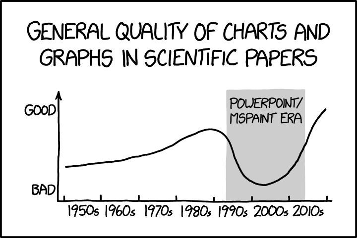

We will be running a series of talks and discussions about data visualisation, including graphs and tables. This page will collate links and resources.

m
m
m
m
m
m
m
m
m
m
m
m

## Schedule

{style="float: right; width: 33%; margin-left: 1em;"}

All sessions will be 16:00 to 17:00 via [Zoom](https://uofglasgow.zoom.us/j/94098494960)

* **2022-02-23** Talk / discussion of "The Science of Visual Data Communication: What Works" ([Franconeri et al., 2021](https://journals.sagepub.com/stoken/default+domain/10.1177%2F15291006211051956-FREE/full)). 
* **2022-03-02** Talk / discussion of "Fooled by beautiful data: Visualization aesthetics bias trust in science, news, and social media" ([Lin & Thornton, 2021](https://psyarxiv.com/dnr9s/)).
* **2022-03-09** Talk on Data visualisation of high dimensional data.
* **2022-03-16** Talk / discussion of "Riding tables with {gt} and {gtExtras}" ([Nowak, 2021](https://bjnnowak.netlify.app/2021/10/04/r-beautiful-tables-with-gt-and-gtextras/))

## Resources

* [Data visualisation using R, for researchers who don't use R](https://psyarxiv.com/4huvw/) (Nordmann et al., 2021).
* [The Science of Visual Data Communication: What Works](https://journals.sagepub.com/stoken/default+domain/10.1177%2F15291006211051956-FREE/full) (Franconeri et al., 2021).
* [Fooled by beautiful data: Visualization aesthetics bias trust in science, news, and social media](https://psyarxiv.com/dnr9s/) (Lin & Thornton, 2021).
* [Riding tables with {gt} and {gtExtras}](https://bjnnowak.netlify.app/2021/10/04/r-beautiful-tables-with-gt-and-gtextras/) (Nowak, 2021).
* [Beyond Bar and Line Graphs: Time for a New Data Presentation Paradigm](https://journals.plos.org/plosbiology/article?id=10.1371/journal.pbio.1002128) (Weissgerber et al., 2015).
* [Two graphs walk into a bar: Readout-based measurement reveals the Bar-Tip Limit error...](https://jov.arvojournals.org/article.aspx?articleid=2778118) (Kerns & Wilmer, 2021). 
* [Data Vizualization: A Practical Introduction](http://socviz.co/) (Healy, 2018)

## R-specific resources

* [The R Graph Gallery](http://www.r-graph-gallery.com/)
* [Top 50 ggplot2 Visualizations](http://r-statistics.co/Top50-Ggplot2-Visualizations-MasterList-R-Code.html)
* [Graphs](http://www.cookbook-r.com/Graphs) in *Cookbook for R*
* [R Graphics Cookbook](http://www.cookbook-r.com/Graphs/) by Winston Chang
* [ggplot extensions](https://www.ggplot2-exts.org/)
* [plotly](https://plot.ly/ggplot2/) for creating interactive graphs
* [Drawing Beautiful Maps Programmatically](https://r-spatial.org/r/2018/10/25/ggplot2-sf.html)
