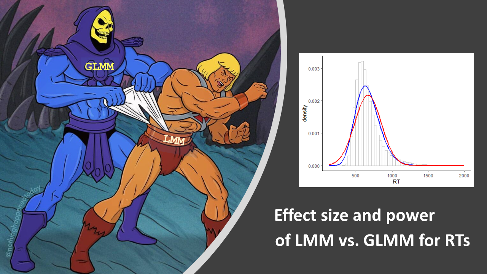

We will be running a series of talks, workshops and discussions about generalised linear mixed models (GLMM). This page will collate links and resources.

m
m
m
m
m
m
m
m
m
m
m
m

## Schedule

{style="float: right; width: 33%; margin-left: 1em;"}

All sessions will be 16:00 to 17:00 via [Zoom](https://uofglasgow.zoom.us/j/94098494960)

* **2021-11-03** A Gentle Introduction to Generalized Linear Mixed Models
* **2021-11-10** Rating norms should be calculated from cumulative link mixed effect models ([Taylor et al., 2021](https://psyarxiv.com/3vgwk/))
* **2021-11-17** Generalized Linear Mixed Models for RT data ([Brysbaert & Stevens, 2018](https://doi.org/10.5334/joc.10); [Lo & Andrews, 2015](https://doi.org/10.3389/fpsyg.2015.01171))
* **2021-11-24** Pushback against GLMMs ([Gomila, 2021](https://doi.org/10.1037/xge0000920); [Knief & Forstmeier, 2021](https://doi.org/10.3758/s13428-021-01587-5); [Ryan, Evers & Moore, 2021](https://doi.org/10.1525/collabra.27242))

## Resources

* [Learning Statistical Models Through Simulation in R](https://psyteachr.github.io/stat-models-v1/)
* Brysbaert, M. and Stevens, M. (2018) Power Analysis and Effect Size in Mixed Effects Models: A Tutorial. Journal of Cognition, 1(1): 9, pp. 1–20, [DOI: 10.5334/joc.10](https://doi.org/10.5334/joc.10)
* [Probit vs logit](https://blog.stata.com/2016/01/07/probit-or-logit-ladies-and-gentlemen-pick-your-weapon/)
* [Logistic regression shiny app](https://shiny.psy.gla.ac.uk/Dale/logit/)
* [Simulating binomial data with crossed random factors](https://debruine.github.io/lmem_sim/articles/appendix3a_binomial.html)
* Taylor, J. E., Rousselet, G. A., Scheepers, C., & Sereno, S. C. (2021, August 3). Rating Norms Should be Calculated from Cumulative Link Mixed Effects Models. [DOI: 10.31234/osf.io/3vgwk](https://doi.org/10.31234/osf.io/3vgwk)
* Lo, S. and Andrews, S. (2015) To transform or not to transform: using generalized linear mixed models to analyse reaction time data. Frontiers in Psychology 6:1171. [DOI: 10.3389/fpsyg.2015.01171](https://doi.org/10.3389/fpsyg.2015.01171)
* Gomila, R. (2021). Logistic or linear? Estimating causal effects of experimental treatments on binary outcomes using regression analysis. Journal of Experimental Psychology: General, 150(4), 700–709. [DOI: 10.1037/xge0000920](https://doi.org/10.1037/xge0000920)
* Knief U, Forstmeier W. (2021). Violating the normality assumption may be the lesser of two evils. Behav Res Methods. [DOI: 10.3758/s13428-021-01587-5](https://doi.org/10.3758/s13428-021-01587-5)
* William H. Ryan, Ellen R. K. Evers, Don A. Moore; Poisson Regressions: A Little Fishy. Collabra: Psychology 4 January 2021; 7 (1): 27242. [DOI: 10.1525/collabra.27242](https://doi.org/10.1525/collabra.27242)
